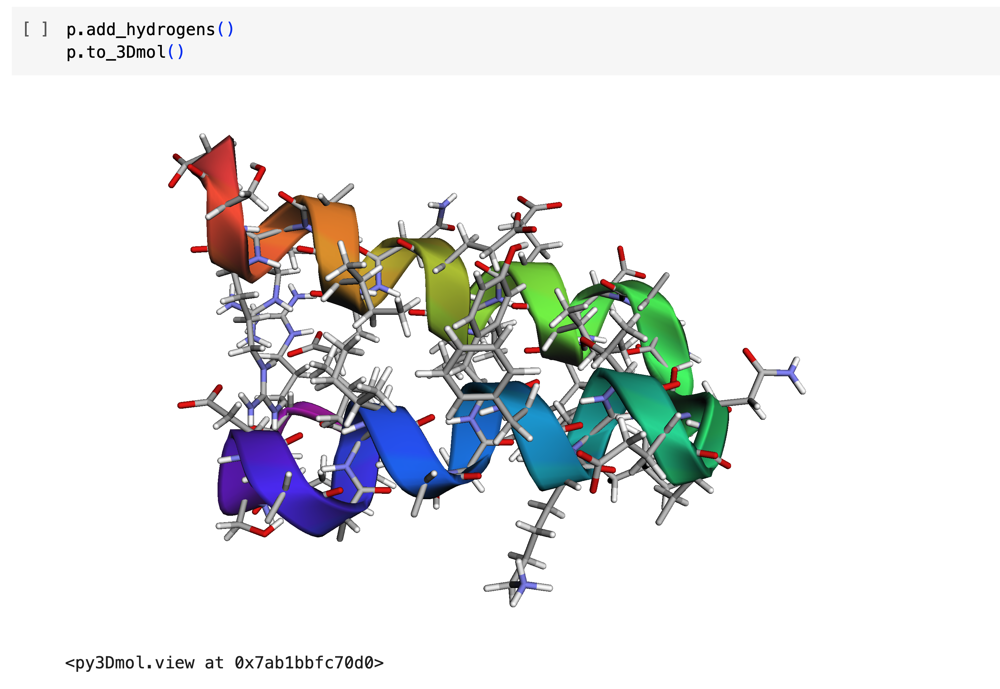

SidechainNet
==============================
[//]: # (Badges)
[](https://travis-ci.com/jonathanking/sidechainnet)

**[Colab Walkthrough](https://colab.research.google.com/drive/11ZZyqwfu7ZTyUKdqt9uy59AqqYccRVcU?usp=sharing), [arXiv](https://arxiv.org/abs/2010.08162)**

SidechainNet is a protein structure prediction dataset that directly extends [ProteinNet](https://github.com/aqlaboratory/proteinnet)<sup>1</sup> by Mohammed AlQuraishi.

Specifically, SidechainNet adds measurements for protein angles and coordinates that describe the complete, all-atom protein structure (backbone *and* sidechain, excluding hydrogens) instead of the protein [backbone](https://foldit.fandom.com/wiki/Protein_backbone) alone.

**This repository provides the following:**
1. SidechainNet datasets stored as pickled Python dictionaries.
2. Methods for loading and batching SidechainNet data efficiently in PyTorch. 
3. Methods for generating protein structure visualizations (`.pdb`, [`3Dmol`](http://3dmol.csb.pitt.edu), `.gltf`) from model predictions.

 
## Summary of SidechainNet data
 
| Entry | Dimensionality* | Label in SidechainNet data | ProteinNet | SidechainNet | 
| :---: | :---: |  :---: | :---: | :---: | 
| Primary sequence | *L x 1* | `seq` | X | X | 
| Secondary structure ([DSSP](https://swift.cmbi.umcn.nl/gv/dssp/DSSP_2.html))<sup>\*\*</sup> | *L x 1* | `sec` | X | X |
| [PSSM](https://en.wikipedia.org/wiki/Position_weight_matrix) + Information content | *L x 21* |  `evo` | X | X | 
| Missing residue mask | *L x 1* |  `msk` | X | X | 
| Backbone coordinates | *L x 4<sup>\*\*\*</sup> x 3* |  `crd`, subset `[0:4]` | X | X | 
| Backbone torsion angles | *L x 3* |  `ang`, subset `[0:3]` |  | X | 
| Backbone bond angles | *L x 3* |  `ang`, subset `[3:6]` |  | X | 
| Sidechain torsion angles | *L x 6* |   `ang`, subset `[6:12]` |  | X | 
| Sidechain coordinates | *L x 10 x 3* |  `crd`, subset `[4:14]` |  | X | 
| Structure resolution | *1* | `res` | | X |

**L* reperesents the length of any given protein in the dataset.

<sup>*\*</sup>Secondary structure is acquired from ProteinNet for training sets only. (Added January 2021)

<sup>**\*</sup>SidechainNet explicitly includes oxygen atoms as part of the backbone coordinate data in contrast to ProteinNet, which only includes the primary `N, C_alpha, C` atoms.

## Installation
To run this code, it's recommended to first clone the repo into an appropriate source directory with `git clone <CLONE_URL>`. Then, perform a developmental install of the package with pip in your current environment with `pip install -e .`. This will install the `sidechainnet` package in your environment.

## Usage Examples

### Loading SidechainNet as a Python dictionary

```python
import sidechainnet as scn
data = scn.load(casp_version=12, thinning=30)
```
In its most basic form, SidechainNet is stored as a Python dictionary organized by train, validation, and test splits. These splits are identical to those described in ProteinNet.
 
 Within each train/validation/test split in SidechainNet is another dictionary mapping data entry types (`seq`, `ang`, etc.) to a list containing this data type for every protein. In the example below, `seq{i}`, `ang{i}`, ... all refer to the `i`<sup>th</sup> protein in the dataset.
```python
data = {"train": {"seq": [seq1, seq2, ...],  # Sequences
                  "ang": [ang1, ang2, ...],  # Angles
                  "crd": [crd1, crd2, ...],  # Coordinates
                  "evo": [evo1, evo2, ...],  # PSSMs and Information Content
                  "sec": [sec1, sec2, ...],  # Secondary structure labels (DSSP)
                  "res": [res1, res2, ...],  # X-ray crystallographic resolution
                  "ids": [id1, id2,   ...]   # Corresponding ProteinNet IDs
                  },
        "valid-10": {...},
            ...
        "valid-90": {...},
        "test":     {...},
        "settings": {...},
        "description" : "SidechainNet for CASP 12."
        "date": "January 20, 2020"
        }
```
By default, the `load` function downloads the data from the web into the current directory and loads it as a Python dictionary. If the data already exists locally, it reads it from disk. Other than the requirement that the data must be loaded using Python, this method of data loading is agnostic to any downstream analyses

### Loading SidechainNet with PyTorch DataLoaders
The `load` function can also be used to load SidechainNet data as a dictionary of `torch.utils.data.DataLoader` objects. PyTorch `DataLoaders` make it simple to iterate over dataset items for training machine learning models. This method is recommended for using SidechainNet data with PyTorch.


```python
>>> dataloaders = scn.load(casp_version=12, with_pytorch="dataloaders")
>>> dataloaders.keys()
['train', 'train_eval', 'valid-10', ..., 'valid-90', 'test']
>>> dataloaders['train'].dataset
ProteinDataset(casp_version=12, split='train', n_proteins=81454,
               created='Sep 20, 2020')
>>> for batch in dataloaders['train']:
....    predicted_angles = model(batch.seqs)
....    sb = scn.BatchedStructureBuilder(batch.int_seqs, predicted_angles)
....    predicted_coords = sb.build()
....    loss = compute_loss(batch.angs, batch.crds,               # True values
....                        predicted_angles, predicted_coords)   # Predicted values
....    ...

```

For more information on the `batch` variable, see the section *Using SidechainNet to train an all-atom protein structure prediction model* below.

By default, the provided `DataLoader`s use a custom batching method that randomly generates batches of proteins of similar length. For faster training, it generates larger batches when the average length of proteins in the batch is small, and smaller batches when the proteins are large. The probability of selecting small-length batches is decreased so that each protein in SidechainNet is included in a batch with equal probability. See `dynamic_batching` and `collate_fn` arguments for more information on modifying this behavior. In the example below, `model_input` is a collated Tensor containing sequence and PSSM information.


### Converting Angle Representations into All-Atom Structures
An important component of this work is the inclusion of both angular and 3D coordinate representations of each protein. Researchers who develop methods that rely on angular representations may be interested in converting this information into 3D coordinates. For this reason, SidechainNet provides a method to convert the angles it provides into Cartesian coordinates.

In the below example, `angles` is a NumPy matrix or Torch Tensor following the same organization as the NumPy angle matrices provided in SidechainNet. `sequence` is a string representing the protein's amino acid sequence.

```python
>>> (len(batch.seqs), batch.angs.shape)  # 12 angles per residue
(128, (128, 12))
>>> sb = scn.StructureBuilder(batch.seqs, batch.angs)
>>> coords = sb.build()
>>> coords.shape  # 14 atoms per residue (128*14 = 1792)
(1792, 3)
```

### Visualizing & Interacting with All-Atom Structures (`PDB`, `py3Dmol`, and `gLTF`)
SidechainNet also makes it easy to visualize both existing and predicted all-atom protein structures. These visualizations are available as `PDB` files, `py3Dmol.view` objects, and Graphics Library Transmission Format (`gLTF`) files. Examples of each are included below.

The PDB format is a typical format for representing protein structures and can be opened in software tools like PyMOL. `py3Dmol` (built on [3Dmol.js](http://3dmol.csb.pitt.edu)<sup>2</sup>) enables users to **visualize and interact** with protein structures on the web and in Jupyter Notebooks via an open-source, object-oriented, and hardware-accelerated Javascript library. Finally, `gLTF` files, despite their larger size, can be convenient for visualizing proteins on the web or in contexts where other protein visualization tools are not supported. 



```python
>>> sb.to_pdb("example.pdb")
>>> sb.to_gltf("example.gltf")
```

### Using SidechainNet to train an all-atom protein structure prediction model 

Below is an outline of how to use this repository for machine learning model training. Assuming you have a predictive model variable `model` and a loss function `loss_fn` used to evaluate your model, you can load SidechainNet using our DataLoaders and begin training.

```python
import sidechainnet as scn

data = scn.load(casp_version=12,thinning=30, with_pytorch="dataloaders")

for epoch in range(100):
    # Training epoch
    for batch in data['train']:
        predictions = model(batch.seqs)
        loss = loss_fn(predictions, batch.angs, batch.crds)
        loss.backwards()
        ...
    
    # Evaluate performance on down-sampled training set for efficiency
    for batch in data['train-eval']:
        predictions = model(batch.seqs)
        loss = loss_fn(predictions, batch.angs, batch.crds)
        loss.backwards()
        ...

    # Evaluate performance on each of the 7 validation sets
    for valid_set in [data[f'valid-{split}'] for split in scn.utils.download.VALID_SPLITS]:
        for batch in valid_set:
            predictions = model(batch.seqs)
            loss = loss_fn(predictions, batch.angs, batch.crds)
            loss.backwards()
            ...

# Evaluate performance on test set
for batch in data['test']:
    predictions = model(batch.seqs)
    loss = loss_fn(predictions, batch.angs, batch.crds)
    ...
```

The `batch` variable above is a `collections.namedtuple` that has the following attributes:

| Attribute | Description |
| :---: | :--- |
 | `batch.pids` | Tuple of ProteinNet/SidechainNet IDs for proteins in this batch |
 | `batch.seqs` | Tensor of sequences, either as integers or as one-hot vectors depending on value of `scn.load(... seq_as_onehot)` |
| `batch.msks` | Tensor of missing residue masks, (redundant with padding in data) |
| `batch.evos` | Tensor of Position Specific Scoring Matrix + Information Content |
| `batch.secs` | Tensor of secondary structure, either as integers or one-hot vectors depending on value of `scn.load(... seq_as_onehot)` |
| `batch.angs` | Tensor of angles |
| `batch.crds` | Tensor of coordinates |
| `batch.ress` | Tuple of X-ray crystallographic resolutions, when available. |
| `batch.seq_evo_sec` | Tensor that concatenates values of `seqs`, `evos`, and `secs`. Returned when `scn.load(... aggregate_model_input=True)` |


## Reproducing SidechainNet

If you would like to reproduce our work or make modifications to the dataset, you may follow [these directions](how_to_reproduce.md) to generate SidechainNet from scratch.


## Package Requirements

- Python 3
- ProDy (`pip install ProDy`)
    - Biopython
    - numpy
    - scipy
- [PyTorch](https://pytorch.org/get-started/locally/)
- tqdm
- py3Dmol (`pip install py3Dmol`)
- pymol (optional, for `gltf` support, [repo](https://pymolwiki.org/index.php/Linux_Install), [linux install](https://pymolwiki.org/index.php/Linux_Install) requires `libxml2`)


## Acknowledgements

Thanks to Mohammed AlQuraishi for his inspiring work on protein structure prediction. Thanks, also, to [Jeppe Hallgren](https://github.com/JeppeHallgren) for his development of a ProteinNet text record [parser](https://github.com/biolib/openprotein/blob/master/preprocessing.py), which I have used in part here.

 This work is supported by R01GM108340 from the National Institute of General Medical Sciences, is supported in part by the University of Pittsburgh Center for Research Computing through the resources provided, and by NIH T32 training grant T32 EB009403 as part of the HHMI-NIBIB Interfaces Initiative.

Project structure (continuous integration, docs, testing) based on the 
[Computational Molecular Science Python Cookiecutter](https://github.com/molssi/cookiecutter-cms) version 1.1.

## References
1. [SidechainNet: An All-Atom Protein Structure Dataset for Machine Learning](https://arxiv.org/abs/2010.08162). J.E. King, D. Koes. arXiv (2020).
1. [ProteinNet: a standardized data set for machine learning of protein structure.](https://doi.org/10.1186/s12859-019-2932-0). M. AlQuraishi. BMC Bioinformatics 20, 311 (2019).
2. [3dmol.js: molecular visualization with WebGL.](https://doi.org/10.1093/bioinformatics/btu829) N. Rego and D. Koes. Bioinformatics, 31(8):1322–1324, (2014).
 

## Copyright

Copyright (c) 2021, Jonathan King
